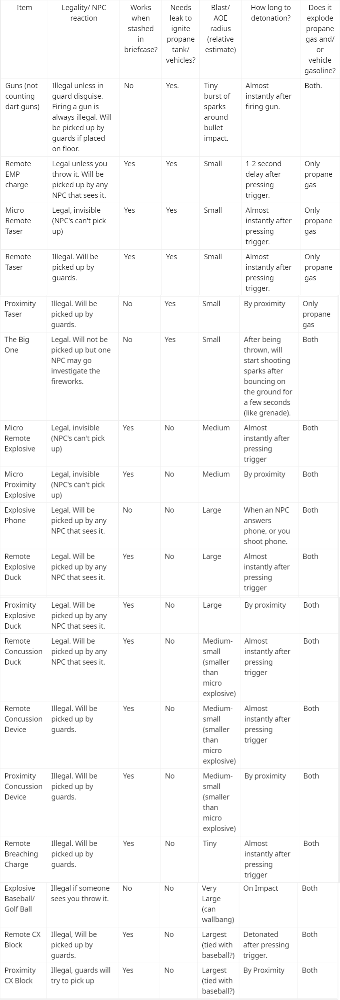
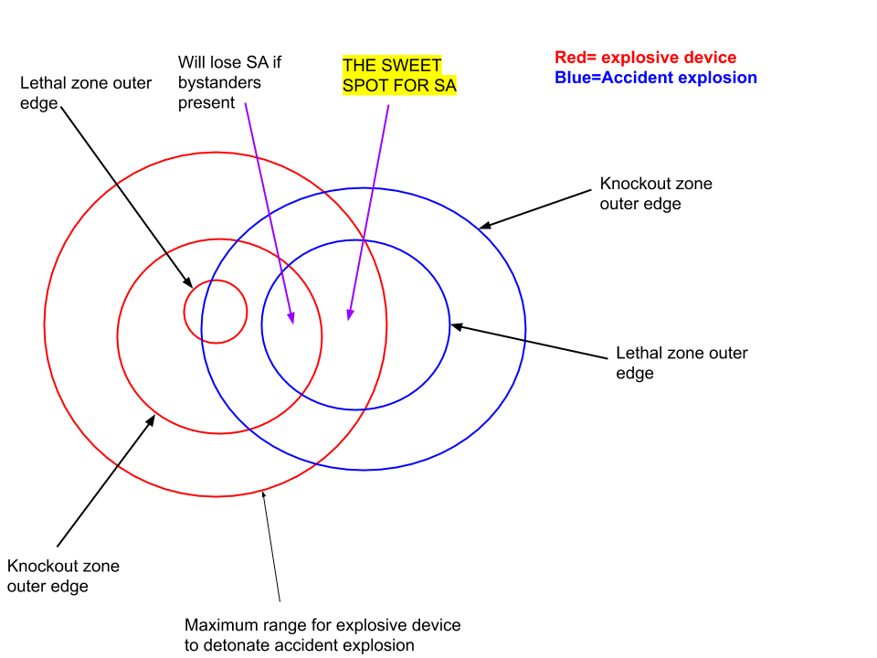

**NOTE: If a certain trick doesn't seem to be mentioned here, please check the other guides here first, or use the search bar.
If you still can't find what you're looking for, feel free to shoot a question in the #hitman-3 channel of the Discord: https://discord.com/invite/E45wUBnxBT
**

## Explosive Properties Tables

Please consult the following tables for explosive device properties before reading further:

- [Zeb's Flying Explosives Spreadsheet](https://docs.google.com/spreadsheets/d/1evp3EMDGanw17w6gxLcSg7t9hjpzb4EqC41xcWOzymc/edit#gid=0)

  - Legality of explosives to hold, drop, throw
  - How long for explosives to fly to destination
  - How far explosives fly
  - Whether to drop and/or place various explosive types for best results (for flying explosives)

- General Explosives Properties / Interactions:
  

- More Info on Explosive Radiii:
  
  (Credit: muddye)

**Note that it is possible to KO or kill a target with an explosive device before the accident explosion kills them. If you KO a target before they die from accident explosion, you lose SA**

- [Example of a propane kill that is not SA due to explosive device being too close, and KOing target](https://youtu.be/9Y2jrg4JYPI)
- Graphic of the sweet spot for SA with an explosive device and accident explosion source: 
- Breaching charge, bullets, Big One, EMP, and tasers can be considered "safe" ways to trigger accident explosions due to not doing much explosive damage themselves.

- Note that accident KO will keep SA on nontargets, but lose you SA on targets.
- Note that EMP and tasers do not ignite vehicle oil for some reason
- Note that car explosions come out of the back, so try to lure targets there for a car kill
- Note that proximity taser does not work when concealed in briefcase unlike other proximity items

## Advanced Accident Explosion Setup Examples

- [Example 1](https://youtu.be/jqbNe-RkfMs?t=148): Breacher propane kill. This is actually pretty basic, but bears repeating. When you are holding propane tank and you drop breaching charge from inventory, it takes a moment for NPC's to realize you dropped an illegal item. If you detonate the breaching charge ASAP, you will keep SA.

- [Example 2](https://youtu.be/CASEkNKCG8I?t=185): Set up a leaking propane+proximity taser to blow up Francesca later. Note the proximity taser is placed behind a door so it cannot be seen before it's too late.

- [Example 3](https://youtu.be/vf9XCjUlc6I): Tripwire propane setup (no leaking needed). Note that a flat vertical surface and a good amount of distance between the propane and tripwire is necessary for a SA tripwire setup. Note also the tripwire is placed to the side where it cannot be seen before it's too late.

- [Example 4](https://youtu.be/gp_m9OzlHl0?t=134): Proximity concussion car explosion setup. Note that I lured two NPC's upstairs so they would stay out of the way while Rico grabbed briefcase. This both prevents the bystanders from picking up the briefcase themselves, and them spotting Rico as he is blown up (concussion will KO him before car explosion kills, so would lose SA with witnesses).

- [Example 5](https://youtu.be/NTJ0egcBqr0?t=94): Proximity concussion car explosion setup. Note that I left some room between the concussion explosive and the briefcase, to prevent a KO before Cassidy dies.

- [Example 6](https://youtu.be/01N4wAJcQ_w?t=119): Proximity concussion propane setup. Note that I place the concussion device and propane at a precise spot so Claus dies as he runs around the corner. Since his guard can't see around the corner as Claus dies, the guard cannot see Claus getting KO'd by the concussion device before dying to propane.

## Advanced Explosive Device Kill Examples

- [Example 1](https://youtu.be/PqRxJjudG-A?t=13): Explosive baseball kill on Soders through wall. Note that Soders' body simply cannot be found no matter how you kill him; Soders is also more frail than other NPC's. Most explosives will work here although Shaman Powder or Explosive Baseball are best.

- [Example 2](https://youtu.be/ITWmeusSv48?t=64): Explosive baseball ceiling wallbang on Jordan Cross. Note that the explosion can travel through the ceiling but not the sound, which is why Cross goes unfound.

- [Example 3](https://youtu.be/RxrDmDqFk9U?t=66): Suitcase breaching charge kill. Note that the breaching charge does have a larger noise radius than you might think, so this technique is not as versatile as you might imagine.

- [Example 4](https://youtu.be/uNuyQ9zCc-w?t=132): Virus wallbang. Note that this only works with the explosive phone, and it must be dropped at a very precise place to work. The phone explosion through the floor triggers a stalactite to fall on virus.

## Flying Explosives!

If you place breaching charge next to another explosive, you can make the second explosive fly. Note that if you place the second explosive too close, it will ignite instantly or in mid-air immediately. Usually you want to place the second explosive device far enough from the breaching charge that it does not explode until triggered. This can enable kills that are otherwise impossible due to long range/ walls in way. C4 is usually optimal for this, as it has biggest explosion radius and can wallbang.

- [Example 1, in depth tutorial](https://youtu.be/ywTUAZBngIM): C4 explosive is launched by breaching charge up to near where the auction chandelier is. Triggering the C4 then causes the chandelier to fall on Dalia.

- [Example 2](https://youtu.be/DX0MfURfqPo?t=13): C4 explosive is launched by breaching charge to where Reza Zeydan's office is. Triggering the C4 later causes an accident kill on Reza Zeydan.

### Flying Explosive Launch Distances

- [Zeb's Flying Explosives Spreadsheet](https://docs.google.com/spreadsheets/d/1evp3EMDGanw17w6gxLcSg7t9hjpzb4EqC41xcWOzymc/edit#gid=0)
  - Legality of explosives to hold, drop, throw
  - How long for explosives to fly to destination
  - How far explosives fly
  - Whether to drop and/or place various explosive types for best results (for flying explosives)

(Sorted Lowest to Highest Distance, non-exhaustive list)

- Napoleon
- Modular Explosive
- Micro Explosive
- C4
- Ducker
