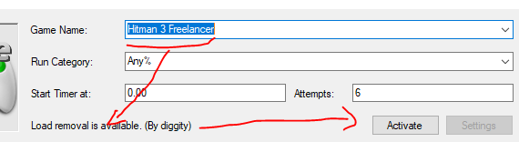

## Video Demos (Installation / Usage)

- [Demo Video (Freelancer Game Mode)](https://youtu.be/S1nyeAB1da4)
  - No installation steps shown but [see below](livesplit_freelancer#installation)
  - Demo of how the splitter works, removing loads from the timing
    Credits: [Mitchell Merry](https://github.com/mitchell-merry)

## Specification

This is a load remover for the Freelancer game mode. It pauses the timer during the longer loading screens when loading to and from the safehouse. It doesn't remove all loading screens at the moment. See the above demo video for which loading screen is removed.

The load remover is RTA loadless, not in-game-time. It counts the time spent in Inventory or Pause screen. It _can_ be used in the main game mode but it is not advised.

It only supports Steam and Epic at the moment for the May 2023 patch. See the [Contribution Guidelines](livesplit_freelancer#contribution-instructions) for how to add it for another version, or to update it for a new patch should the time come.

## Installation

Download Livesplit [here](https://livesplit.org/downloads/).

1. Right click LiveSplit -> Edit Splits
2. Change "Game Name" to "Hitman 3 Freelancer"
3. Below, text saying "Load removal is available" should appear with an Activate button. Press Activate.
4. Click OK to close the window
5. Right click on LiveSplit and ensure "Compare Against" is set to "Game Time".

## Usage Instructions

Start game. Press Numpad 1 (default binding). The livesplit timer should turn green, but still be set as 0.

Start the first level; the timer should start after first level's initial cutscene is ended.

You can press numpad 1 again to move the split to the next level (Sapienza). (this is what is meant by, the script does not actually autosplit). If you don't press numpad 1 again, the in game time will be kept track of accurately as you move to the next level, but it will stay on Paris or whatever your first level is.

Press numpad 3 (default value) to reset timer. Remember to press numpad 1 again and wait for timer to turn green to start again if you want to go again.

## Contribution Instructions

See the [README](https://github.com/mitchell-merry/autosplitters/blob/main/Hitman%203/README.md) for how to find the corresponding memory addresses for Steam / Epic, and also how to update the memory addresses after each game update. You can find the source code [here](https://github.com/mitchell-merry/autosplitters/blob/main/Hitman%203/hitman3.asl).

### Credits

- [mitchell-merry](https://github.com/mitchell-merry) (Steam)
- [Finalist](https://www.speedrun.com/user/Finalist) (Epic)
